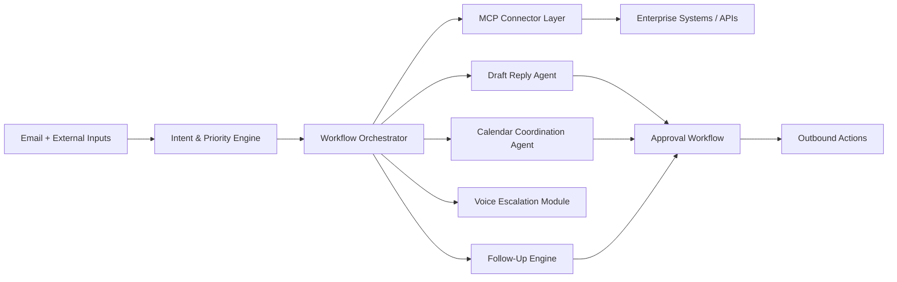

# 🚀 OrchestrAI Agent

<div align="center">


### **Next-Generation Autonomous AI Operations Platform**

*Enterprise AI orchestration framework for executive workflows, communications, and operations automation.*

</div>

---

## ✨ Vision

**OrchestrAI Agent** is an AI-native productivity infrastructure layer that acts as an autonomous executive assistant and operations coordinator. It continuously processes inboxes, prioritizes intent, coordinates calendars, triggers follow-ups, and escalates urgent actions through voice and enterprise systems.

---

## 🧠 Core Capabilities

- 📩 Read, classify, and prioritize inbound email threads.
- ✍️ Draft context-aware replies with configurable approval workflows.
- 📆 Create and manage calendar events across colleague calendars.
- 🤝 Coordinate meetings across teams and departments.
- 🔁 Follow up on unanswered threads automatically.
- 🔌 Connect through MCP and enterprise APIs.
- ☎️ Trigger voice escalations for urgent or reservation-related workflows.
- 🧩 Integrate with Microsoft 365, Outlook, Teams, SharePoint, Business Central, CRM systems.
- 🛡️ Keep auditable logs, policy checks, and human-in-the-loop controls.

---

## 🏗️ Architecture Overview



### Layered Design

1. **Interface Layer**: API, dashboard, and user-facing controls.
2. **Agent Layer**: Specialized agents for email, calendar, follow-up, and coordination.
3. **Workflow Layer**: Rule-driven and AI-driven orchestration engines.
4. **Integration Layer**: MCP adapters + enterprise service connectors.
5. **Operations Layer**: Logging, observability, security, and deployment.

---

## 🧱 Enterprise Project Structure

```text
orchestrai-agent/
├── backend/
├── agents/
├── integrations/
├── voice/
├── mcp/
├── workflows/
├── prompts/
├── docs/
├── ui/
├── dashboard/
├── tests/
└── infrastructure/
```

---

## 🛠️ Tech Stack

- **Language**: Python 3.11+
- **API Framework**: FastAPI
- **AI**: OpenAI APIs
- **Context & Tooling**: MCP (Model Context Protocol)
- **Async Runtime**: Uvicorn / asyncio
- **Validation**: Pydantic
- **Voice Escalation**: Twilio / Vapi placeholders
- **Infra**: Docker Compose + Terraform/Kubernetes placeholders

---

## 🧭 Key Workflows

### 1) Email-to-Action Orchestration
- Poll inbox providers
- Extract intent, urgency, participants, deadlines
- Route to reply, scheduling, or escalation pipeline

### 2) Calendar Coordination
- Resolve participant availability
- Propose time slots
- Create and update events

### 3) Follow-Up Automation
- Track unanswered threads
- Trigger reminders and escalation policies

### 4) Voice Escalation
- Initiate call workflows for urgent confirmations
- Route unresolved tasks to voice agents/humans

---

## 📸 Product Demo Placeholders

> Add screenshots / GIFs for:
- Dashboard overview (`docs/assets/dashboard-overview.png`)
- Workflow timeline (`docs/assets/workflow-timeline.png`)
- Agent activity monitor (`docs/assets/agent-monitor.png`)

---

## ⚙️ Quick Start

```bash
git clone <your-repo-url>
cd orchestrai-agent
python -m venv .venv
source .venv/bin/activate
pip install -r requirements.txt
cp .env.example .env
uvicorn backend.app.main:app --reload
```

API Docs: `http://localhost:8000/docs`

---

## 🗺️ Roadmap

See detailed roadmap in [`docs/roadmap.md`](docs/roadmap.md).

- **Phase 1**: Core orchestration + email/calendar flows
- **Phase 2**: Deep enterprise integrations + approvals
- **Phase 3**: Voice agents + autonomous multi-agent scheduling
- **Phase 4**: AI memory, planning, and adaptive operations layer

---

## 🏢 Enterprise Positioning

OrchestrAI Agent is designed as:

- **An enterprise AI orchestration framework**
- **An AI executive workflow assistant**
- **An AI-native operations coordination platform**
- **A future-ready productivity infrastructure stack**

---

## 🤝 Contributing

Contributions are welcome. Please:

1. Fork the repo
2. Create a feature branch
3. Add tests/docs for your changes
4. Open a PR with architecture impact notes

---

## 📜 License

MIT License — see [`LICENSE`](LICENSE) (placeholder).

---

## 🌌 Future Vision

OrchestrAI evolves from workflow automation into a **multi-agent enterprise operating fabric** where AI continuously coordinates communication, planning, execution, and follow-through across organizational systems.
